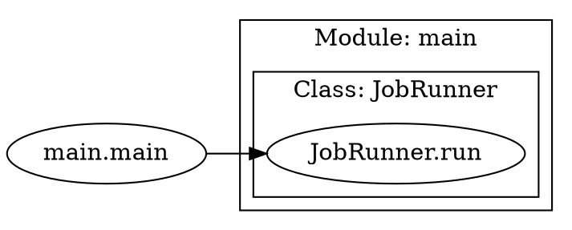

## 代码调用图分析 (`callgraph`)

`callgraph` 是一个内置的静态分析工具，旨在帮助开发者快速理解和分析 Python 项目的内部结构。它通过生成一个清晰、可视化的函数与方法调用关系图，让你能够直观地看到代码是如何协同工作的。

这个工具对于以下场景尤其有用：

  * 快速上手一个陌生的、复杂的代码库。
  * 在进行大型重构前，评估改动可能带来的影响。
  * 辅助代码审查（Code Review），理解新功能的架构。
  * 团队成员之间的知识分享和技术交流。

### ✨ 核心功能

  * 🎯 **精准聚焦**: 自动过滤掉对标准库和第三方库的调用，只展示项目中由你**自己定义的类、方法和函数**之间的调用关系，让你专注于核心业务逻辑。
  * 🔬 **实例追踪**: 通过基于启发式规则的静态类型推断，能够追踪在函数内创建的**类实例**，并分析其后续的方法调用。
  * 🏗️ **结构化视图**: 在图中，方法会自动聚合到其所属的**类**中，而类和顶级函数则会归属到其所在的**模块**下，形成层级分明、易于理解的嵌套视图。
  * flexible **双模式分析**: 支持对**整个项目目录**的宏观分析，也支持对**单个文件**的微观分析。
  * 🎨 **多种输出格式**: 支持一键生成多种格式的产物，以适应不同需求：
      * `.png` / `.svg`: 用于直接查看的可视化图片。
      * `.dot`: Graphviz 的源文件，便于高级用户自定义图形。
      * `.json`: 结构化的知识图谱数据，便于程序化处理。

### ⚙️ 前置要求

为了生成可视化图片（如 `.png` 或 `.svg`），你的系统中必须安装 **Graphviz**。本工具会通过 `dot` 命令来调用它。

  * **Windows**:
    从官网下载并安装：[https://graphviz.org/download/](https://graphviz.org/download/)

    > **重要提示**: 安装时，请务必勾选 "Add Graphviz to the system PATH for all users" 选项。

  * **macOS (使用 Homebrew)**:

    ```bash
    brew install graphviz
    ```

  * **Linux (Ubuntu/Debian)**:

    ```bash
    sudo apt-get update
    sudo apt-get install graphviz
    ```

### 🚀 使用方法

`callgraph` 命令的基本用法如下：

```bash
awesome-cli callgraph [PATH] [OPTIONS]
```

#### 参数说明

| 参数 | 标志 | 说明 |
| :--- | :--- | :--- |
| `PATH` | (无) | **必需参数**。要分析的 Python 项目目录或单个文件的路径。 |
| `--output-prefix` | `-o` | (可选) 输出文件的前缀。默认为 `call_graph`。例如，`my_analysis` 会生成 `my_analysis.png`, `my_analysis.dot` 等。 |
| `--formats` | `-f` | (可选) 指定一个或多个输出格式。可多次使用。默认为 `png dot json`。可选值包括: `png`, `svg`, `dot`, `json`。 |

#### 使用示例

**1. 分析整个项目并生成所有默认格式的文件**

```bash
awesome-cli callgraph ./path/to/your/project
```

这会在当前目录下生成 `call_graph.png`, `call_graph.dot`, 和 `call_graph.json`。

**2. 分析单个文件，并自定义输出**

```bash
awesome-cli callgraph ./my_project/main.py -o ./output/main_calls -f png -f json
```

这个命令会：

  * 只分析 `main.py` 文件。
  * 在 `output/` 目录下生成 `main_calls.png` 和 `main_calls.json` 两个文件。

### 📄 输出格式说明

#### 1\. 可视化图片 (`.png`, `.svg`)

这是最直观的输出，直接展示了调用关系图。模块、类和方法/函数被清晰地组织在嵌套的框中。

#### 2\. DOT 源文件 (`.dot`)

这是生成图形的“源代码”。你可以手动编辑它来调整样式，或者使用其他兼容 Graphviz 的工具来处理。



#### 3\. 知识图谱数据 (`.json`)

这是一个机器可读的结构化文件，用邻接表的形式表示了调用图。非常适合用于进一步的自动化分析或数据导入。

```json
{
    "main.main": [
        "main.JobRunner.__init__",
        "main.JobRunner.run"
    ],
    "main.JobRunner.run": [
        "services.data_service.DataFetcher.__init__",
        "services.data_service.DataFetcher.fetch"
    ]
}
```

### ⚠️ 局限性

本工具是基于**静态分析**的，这意味着它通过分析源代码来推断调用关系，而不会实际执行代码。因此，它存在静态分析的固有局限性，可能无法处理：

  * 通过 `eval()`, `getattr()` 等方式实现的**动态调用**。
  * 复杂的控制流或数据流导致的变量类型变化（例如，一个变量在不同条件下被赋为不同类的实例）。
  * 存储在列表或字典等容器中的对象的方法调用。

尽管如此，对于绝大多数遵循标准编码实践的项目，本工具都能提供非常有价值的架构洞察。